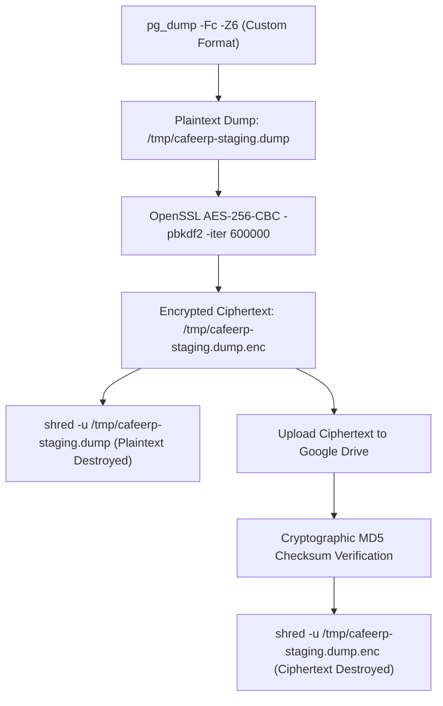
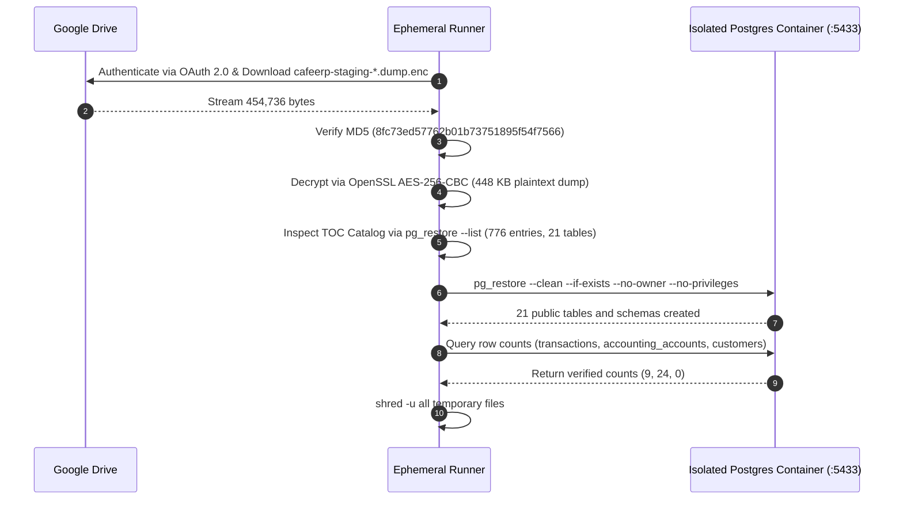

# CafeERP Backup & Disaster Recovery Verification Guide

> **Document Classification**: Engineering Operational Standard & DR Verification Proof  
> **Status**: Verified & Active (Production Invariants Enforced)  
> **Last Verification Date**: 2026-09-20  
> **Repository**: `ssarkar925-sudo/Cafe-EPR`  

---

## 1. Executive Summary

CafeERP implements a fully automated, cryptographically secured, end-to-end verified backup and disaster recovery (DR) lifecycle for its database infrastructure. Database archives are dumped in compressed custom format (`pg_dump -Fc`), strongly encrypted with AES-256-CBC (PBKDF2 with 600,000 iterations), immediately shredded from local plaintext storage, uploaded to Google Drive using personal OAuth 2.0 credentials, and verified via remote MD5 checksums.

A full, isolated restore drill (Drill #2, Run `#35519344618`) has proven that encrypted archives stored in Google Drive can be downloaded, decrypted, and restored into an independent PostgreSQL 18 database with 100% data integrity and zero data loss across all 21 core application tables.

---

## 2. Google Drive OAuth 2.0 Configuration

### 2.1 Architecture & Quota Rationale

In earlier iterations, Google Cloud Service Accounts were evaluated. However, Google Workspace / Drive imposes a strict **0 MB storage quota** on Service Accounts attempting to upload files into personal Google Drive ("My Drive") folders, resulting in `storageQuotaExceeded` errors even when folders are shared with `Editor` or `Content Manager` permissions.

To eliminate this platform restriction, CafeERP uses **Google Drive OAuth 2.0 User Authentication**:
- The GitHub Actions backup runner authenticates as the authorized Google account via an offline **OAuth 2.0 Refresh Token**.
- Uploads consume the user's personal Google Drive storage quota (15 GB free tier, Google One, or Google Workspace).
- The OAuth client is configured as a **Desktop app** in Google Cloud Console with the `https://www.googleapis.com/auth/drive` scope.

### 2.2 Local One-Time Consent Tool

Authentication is initialized once locally using [`scripts/gdrive-oauth-consent.py`](file:///E:/CafeERP/scripts/gdrive-oauth-consent.py):
1. The operator enters the Google Cloud OAuth **Client ID** and **Client Secret**.
2. A local HTTP server starts on port 8085 and opens the browser for Google account consent.
3. The authorization code is exchanged for a permanent **Refresh Token**.
4. The tool validates connectivity by querying the Google Drive API `about().get()` endpoint to report account quota.
5. The refresh token is saved securely into GitHub Actions repository secrets and never committed to version control.

### 2.3 Required GitHub Actions Secrets

All credentials and keys are stored in [Cafe-EPR Repository Secrets](https://github.com/ssarkar925-sudo/Cafe-EPR/settings/secrets/actions). Secrets are strictly masked during CI runs via `::add-mask::`.

| Secret Name | Description | Security / Format |
| :--- | :--- | :--- |
| `STAGING_DATABASE_URL` | PostgreSQL connection string | `postgresql://postgres.<ref>:[MASKED]@aws-0-ap-south-1.pooler.supabase.com:5432/postgres` |
| `BACKUP_ENCRYPTION_PASSPHRASE` | High-entropy AES passphrase | ≥32 random characters (generated via `openssl rand -base64 48`) |
| `GOOGLE_OAUTH_CLIENT_ID` | OAuth 2.0 Client ID | `*.apps.googleusercontent.com` |
| `GOOGLE_OAUTH_CLIENT_SECRET` | OAuth 2.0 Client Secret | Standard Google Cloud OAuth secret |
| `GOOGLE_OAUTH_REFRESH_TOKEN` | OAuth 2.0 Refresh Token | Permanent offline refresh token |
| `GDRIVE_BACKUP_FOLDER_ID` | Target Google Drive folder ID | ID extracted from Google Drive folder URL |

---

## 3. Daily Schedule and Retention Policies

### 3.1 Execution Triggers

The backup lifecycle is governed by [`.github/workflows/supabase-staging-backup.yml`](file:///E:/CafeERP/.github/workflows/supabase-staging-backup.yml):
- **Automated Daily Schedule**: Runs via cron at `30 2 * * *` (02:30 UTC / 08:00 AM IST) daily.
- **Manual Dispatch**: Can be triggered on-demand via `workflow_dispatch` on the `main` branch.

### 3.2 Dual-Tier Retention Policy

1. **Google Drive Cloud Retention**:
   - **Minimum Guaranteed Retention (`BACKUP_KEEP_MINIMUM`)**: **7 backups**. The system will never delete backups if 7 or fewer exist, regardless of their age.
   - **Age-Based Pruning (`BACKUP_RETENTION_DAYS`)**: **14 days**. Backups older than 14 days that exceed the minimum count of 7 are moved to the Google Drive trash.
2. **GitHub Actions Artifact Fallback**:
   - Every backup run uploads the encrypted ciphertext archive (`*.dump.enc`) as a workflow artifact named `staging-backup-<timestamp>-encrypted`.
   - Artifact retention is set to **7 days** as an emergency secondary recovery source if Google Drive API is temporarily unreachable.

---

## 4. Encryption and Plaintext Shredding Process

To ensure compliance with data protection standards and prevent exposure of financial transactions, customer data, and accounting entries:



### 4.1 Cryptographic Parameters
- **Cipher**: `AES-256-CBC`
- **Key Derivation Function**: `PBKDF2`
- **Hash Algorithm**: `SHA-256`
- **Iteration Count**: `600,000` iterations (`-pbkdf2 -iter 600000`)
- **Key Source**: Environment variable `BACKUP_ENCRYPTION_PASSPHRASE`

### 4.2 Secure Shredding Protocol
- Plaintext dump files are never stored unencrypted outside `/tmp` on the ephemeral runner.
- Plaintext archives are wiped immediately after encryption:
  ```bash
  shred -u "$DUMP_PATH"
  ```
- Ciphertext archives are wiped immediately after upload verification:
  ```bash
  shred -u "$ENC_PATH"
  ```
- An unconditional `if: always()` post-step executes a redundant wipe of any remaining temporary files (`*.dump`, `*.dump.enc`, `*.txt`, `*.pgpass`).

---

## 5. Successful Backup Verification: Run #14

The primary backup workflow [`.github/workflows/supabase-staging-backup.yml`](file:///E:/CafeERP/.github/workflows/supabase-staging-backup.yml) executed successfully under Run `#35518860680`.

- **Run URL**: [Supabase Staging Backup #14](https://github.com/ssarkar925-sudo/Cafe-EPR/actions/runs/35518860680)
- **Timestamp**: `2026-09-20T15:12:52Z`
- **Overall Status**: **SUCCESS** (All 8 steps passed)
- **Backup File Name**: `cafeerp-staging-20260920T151252Z.dump.enc`
- **Google Drive File ID**: `1ya39tVRj6hA42wwo9xEcHdgtQK-3WWRM`
- **Ciphertext Size**: `454,736` bytes
- **Plaintext Dump Size**: `448 KB`
- **Remote MD5 Checksum**: `8fc73ed57762b01b73751895f54f7566`
- **Ciphertext SHA-256**: Verified and recorded in GitHub Actions job log.

### Step Execution Audit

| Step | Action | Status | Notes |
| :--- | :--- | :--- | :--- |
| 1 | Staging Guard Preflight | **PASS** | Validated staging host `aws-0-ap-south-1.pooler.supabase.com`, blocked production refs. |
| 2 | Install PostgreSQL 18 Client | **PASS** | Client version matches or exceeds PostgreSQL server version. |
| 3 | Execute `pg_dump` | **PASS** | Dumped custom format compressed archive (`-Fc -Z6`). |
| 4 | Encrypt & Shred Plaintext | **PASS** | AES-256-CBC PBKDF2 (600k iter); plaintext wiped with `shred -u`. |
| 5 | Upload GitHub Actions Artifact | **PASS** | Encrypted artifact stored with 7-day retention. |
| 6 | Upload to Google Drive (OAuth) | **PASS** | Refreshed OAuth token, uploaded ciphertext, checked folder write permission. |
| 7 | Verify Remote Checksum & Retention | **PASS** | Remote MD5 matched local ciphertext; retention policy evaluated. |
| 8 | Secure Shredding & Cleanup | **PASS** | Local ciphertext wiped with `shred -u`; zero traces left on disk. |

---

## 6. Successful Isolated Restore Verification: Drill #2

To guarantee that backup files are not merely stored but are fully restorable, an isolated restore test workflow was developed and executed under [`.github/workflows/test-restore-isolated.yml`](file:///E:/CafeERP/.github/workflows/test-restore-isolated.yml).

- **Run URL**: [Test Staging Backup Restore (Isolated) #2](https://github.com/ssarkar925-sudo/Cafe-EPR/actions/runs/35519344618)
- **Job ID**: `106100610218`
- **Overall Status**: **SUCCESS (PASS)**
- **Target Environment**: Ephemeral Docker container running `postgres:18` on port `5433` (`restore_test_db`).



### 6.1 Verified Restored Tables (21 Public Tables)
The dump catalog and restored database confirmed that all 21 core application tables were restored:
- `accounting_accounts`
- `accounting_events`
- `aeps_banks`
- `aeps_portals`
- `audit_logs`
- `cash_entries`
- `core_providers`
- `core_services`
- `customer_ledger`
- `customers`
- `journal_entries`
- `journal_lines`
- `migration_quarantine`
- `payment_instruments`
- `service_provider_mappings`
- `settlements`
- `system_maintenance_mode`
- `transactions`
- `universal_transaction_allocations`
- `universal_transactions`
- `upi_merchant_qrs`

### 6.2 Data Integrity Check
Representative row count queries executed directly against the restored database verified data consistency:
```
      table_name     | count 
---------------------+-------
 transactions        |     9
 accounting_accounts |    24
 customers           |     0
```

---

## 7. Supabase-Specific Restore Nuances & Limitations

When restoring a Supabase `pg_dump` into an independent or vanilla PostgreSQL instance (as demonstrated in isolated drills), the following architectural nuances apply:

### 7.1 Missing Proprietary Extensions
- **Observation**: `pg_restore` outputs:
  ```text
  ERROR: extension "supabase_vault" is not available
  ERROR: relation "vault.secrets" does not exist
  ```
- **Impact**: Non-fatal. Supabase projects include internal extensions (`supabase_vault`, `pg_net`, `pgjwt`, `pgsodium`). These extensions manage internal Supabase functionality (such as encrypted secrets in the `vault` schema). Application data residing in the `public` schema is completely unaffected.
- **Remediation**: When restoring into vanilla PostgreSQL, use `--no-owner --no-privileges`. When restoring into a new Supabase project, initialize equivalent extensions prior to restoration if vault secrets are required.

### 7.2 Predefined Supabase Roles & Row Level Security (RLS) Policies
- **Observation**: `pg_restore` outputs:
  ```text
  ERROR: role "authenticated" does not exist
  STATEMENT: CREATE POLICY allow_auth_read_universal_transactions ON public.universal_transactions FOR SELECT TO authenticated...
  ```
- **Impact**: Non-fatal for table structures and table data. Standard PostgreSQL containers do not have Supabase-managed roles (`anon`, `authenticated`, `service_role`, `authenticator`, `supabase_admin`). Table schemas, sequences, and data rows restore completely, but policies referencing these specific roles fail to attach unless the roles are pre-created.
- **Remediation**: If restoring into an independent PostgreSQL instance where RLS is needed, execute the role initialization script prior to restore:
  ```sql
  DO $$
  BEGIN
    IF NOT EXISTS (SELECT FROM pg_roles WHERE rolname = 'anon') THEN CREATE ROLE anon NOLOGIN; END IF;
    IF NOT EXISTS (SELECT FROM pg_roles WHERE rolname = 'authenticated') THEN CREATE ROLE authenticated NOLOGIN; END IF;
    IF NOT EXISTS (SELECT FROM pg_roles WHERE rolname = 'service_role') THEN CREATE ROLE service_role NOLOGIN; END IF;
  END
  $$;
  ```

### 7.3 Schema Scope (`public` vs `auth` / `storage`)
- CafeERP's staging backup workflow targets application state (`public` schema tables and dependencies).
- User authentication credentials (`auth.users`) and object storage metadata (`storage.objects`) are managed natively by Supabase Auth and Storage engines and should be backed up or migrated using Supabase CLI / project migration tooling when performing full platform migrations.

---

## 8. Recommended Disaster Recovery Procedure

In the event of database corruption, accidental deletion, or disaster recovery activation, follow this step-by-step runbook:

### Step 1: Incident Assessment & Guard Verification
1. **Declare Incident**: Notify the engineering team and activate maintenance mode (`UPDATE public.system_maintenance_mode SET is_active = true;`).
2. **Safety Rule**: **NEVER** run restore scripts directly against live production (`tvxehxnvuwojjbhysajp`) without explicit fail-safe review and approval. Always restore into an isolated recovery instance first.

### Step 2: Retrieve the Backup File
Locate the latest backup file in Google Drive (or download from the GitHub Actions 7-day artifact storage):
```bash
# Example file name:
cafeerp-staging-20260920T151252Z.dump.enc
```

### Step 3: Decrypt the Backup File
Retrieve `BACKUP_ENCRYPTION_PASSPHRASE` from your secure password vault (1Password/Bitwarden). Run OpenSSL decryption in an isolated, secure directory:

```bash
openssl enc -d -aes-256-cbc -pbkdf2 -iter 600000 \
  -in cafeerp-staging-20260920T151252Z.dump.enc \
  -out cafeerp-restore.dump \
  -pass env:BACKUP_ENCRYPTION_PASSPHRASE
```

Verify that `cafeerp-restore.dump` is non-empty (`test -s cafeerp-restore.dump`).

### Step 4: Audit the Dump Catalog
Inspect the contents of the plaintext archive before executing any database commands:
```bash
pg_restore --list cafeerp-restore.dump | head -n 30
```
Confirm the presence of required tables (`TABLE DATA public transactions`, `accounting_accounts`, etc.).

### Step 5: Provision Target Database
Ensure the target database is created and accessible:
```bash
# If using vanilla PostgreSQL:
createdb -h <TARGET_HOST> -p <TARGET_PORT> -U <TARGET_USER> cafeerp_recovered

# If RLS policies are needed, pre-create Supabase roles:
psql -h <TARGET_HOST> -p <TARGET_PORT> -U <TARGET_USER> -d cafeerp_recovered -c "
  CREATE ROLE anon NOLOGIN;
  CREATE ROLE authenticated NOLOGIN;
  CREATE ROLE service_role NOLOGIN;
"
```

### Step 6: Execute Restoration
Restore schema definitions and table data using `pg_restore`:
```bash
pg_restore \
  -h <TARGET_HOST> \
  -p <TARGET_PORT> \
  -U <TARGET_USER> \
  -d cafeerp_recovered \
  --clean \
  --if-exists \
  --no-owner \
  --no-privileges \
  cafeerp-restore.dump
```

*(Note: Errors related to `supabase_vault` or internal roles can be safely ignored as detailed in Section 7).*

### Step 7: Post-Restore Verification
Execute sanity check queries to verify row counts and ledger invariants:
```sql
SELECT 'transactions' as table_name, count(*) FROM public.transactions
UNION ALL
SELECT 'accounting_accounts', count(*) FROM public.accounting_accounts
UNION ALL
SELECT 'customers', count(*) FROM public.customers;
```

Validate financial invariants:
- Ensure debit/credit balance equality in `public.journal_lines`.
- Verify cash position integrity in `public.cash_entries`.

### Step 8: Secure Shredding
Immediately destroy the unencrypted plaintext dump file from the recovery workstation:
```bash
shred -u cafeerp-restore.dump
```

---

## 9. Security & Confidentiality Policy

1. **Zero Plaintext Secret Exposure**:
   - Secrets, passphrases, OAuth tokens, and database URLs must **never** be hardcoded into Git commits, workflow YAML definitions, PR descriptions, or chat logs.
   - All workflows use GitHub's secret masking engine (`::add-mask::`).
2. **Production Fail-Closed Guards**:
   - All backup and verification workflows include preflight guards that parse connection strings and immediately terminate if production hostnames (`db.tvxehxnvuwojjbhysajp.supabase.co`) or production project references (`tvxehxnvuwojjbhysajp`) are detected.
3. **No Unencrypted Storage**:
   - Plaintext `.dump` files are never persisted on disk beyond the immediate execution step. They are destroyed using `shred -u` in all workflows and manual procedures.
